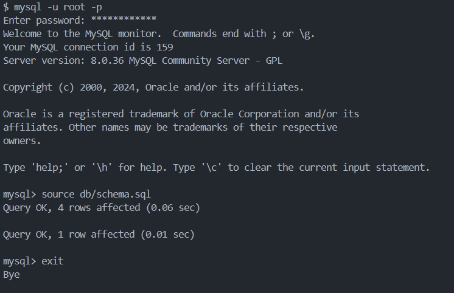
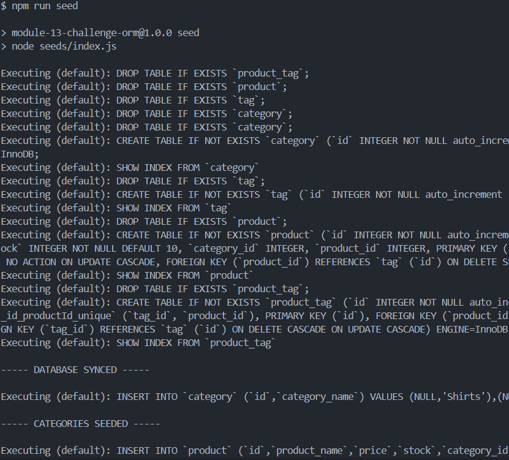
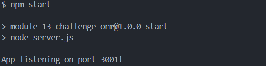
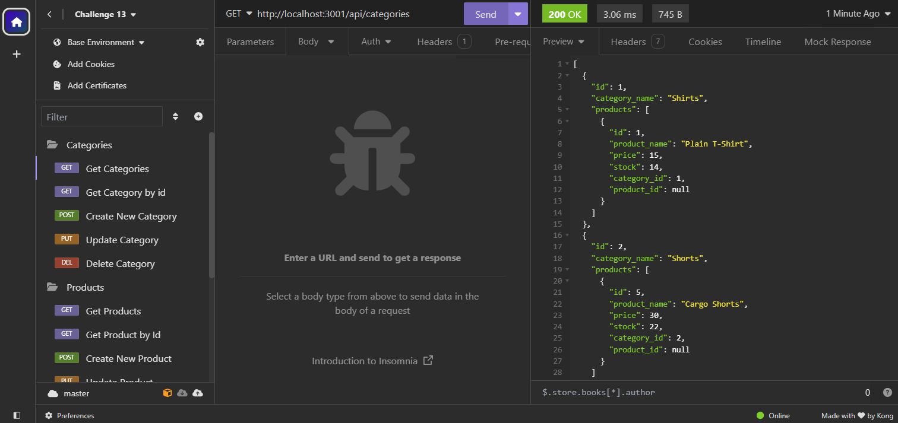
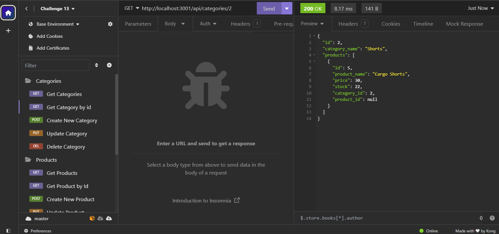
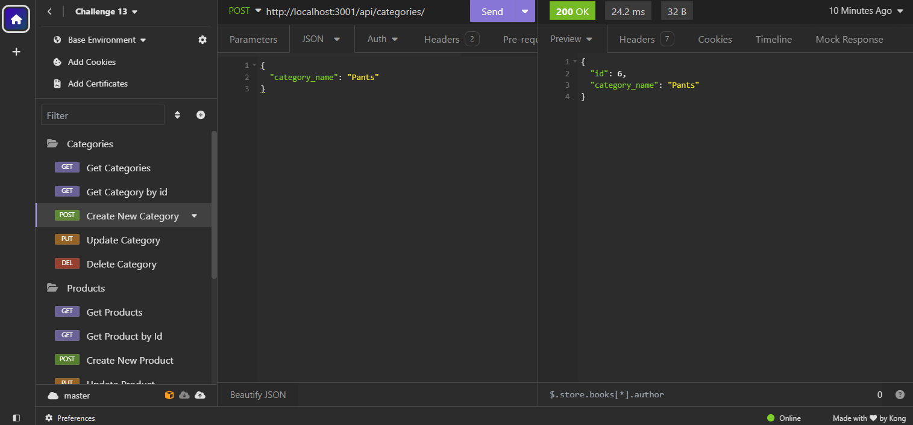
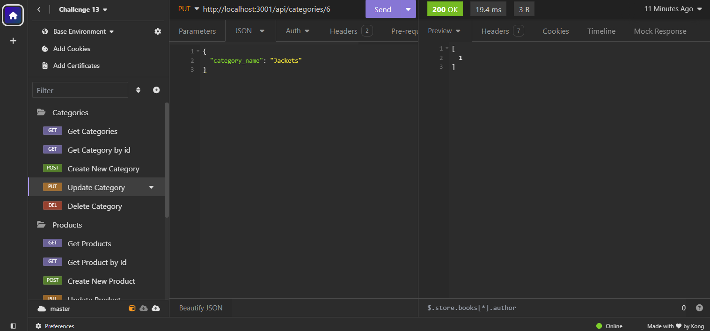
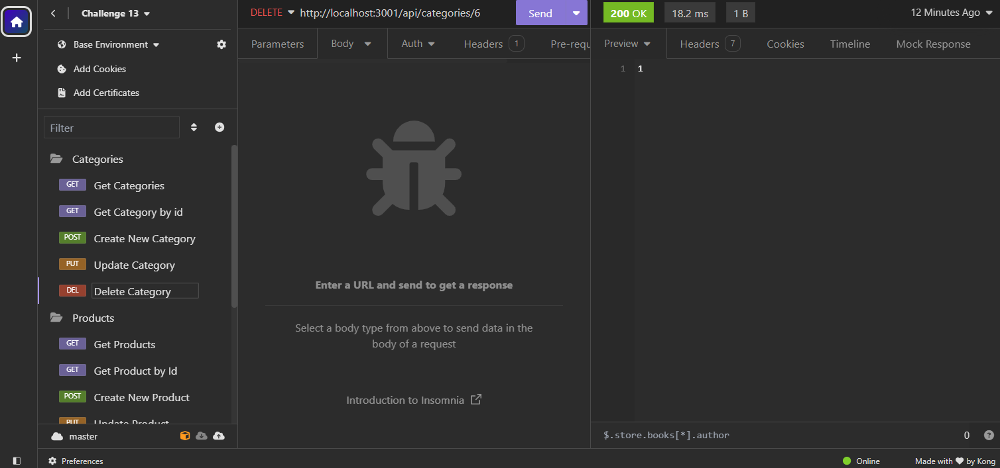

# E-Commerce Back End ORM

## Description

This challenge is to build the back end for an e-commerce site. Working with Express.js API to use Sequelize to interact with a MySQL database. This challenge help me learn where to divide folder for the application. I learn how to use Insomnia how to GET, POST, PUT, and DELETE. I learn how to use sequelize with express.js. I learn how to divide models and how to use routes.

## Usage

Start with `npm i` then connect to MySql databases and use `source db/schema.sql` and then do the `npm run seed` and then do the `npm start` and you can open Insomnia to do GET, POST, PUT, and DELETE request.

This is the link and gif to a walkthrough video that demonstrates its functionality.

[Click to see Walkthrough Video](https://drive.google.com/file/d/1oJeWxCwwQBJM8k7WH5ysqO6Wu65gFYUD/view)

connect to your MySQL and `source db/schema.sql`

`npm run seed`

`npm start`

GET, GET by Id, POST, PUT, DELETE in Insomnia

## Credits

me, my peers, my instructor, Xpert Learning Assistance

## License

MIT License
